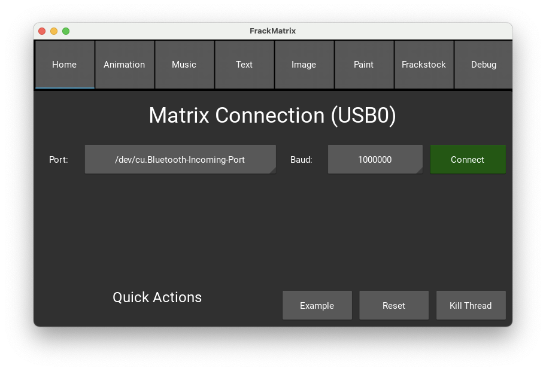
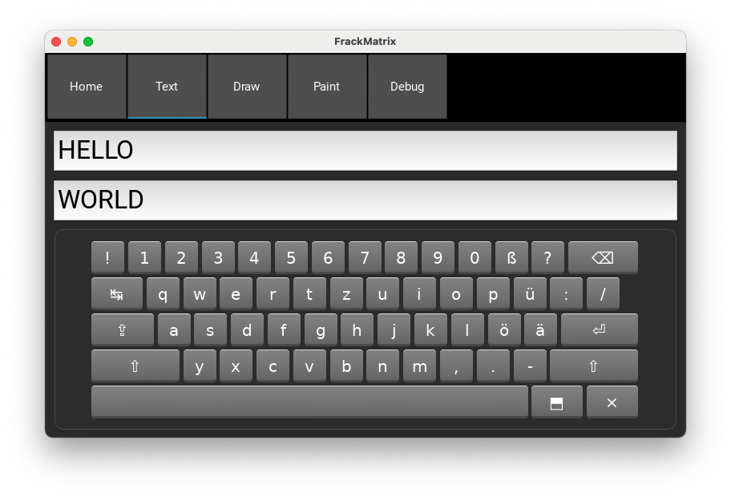
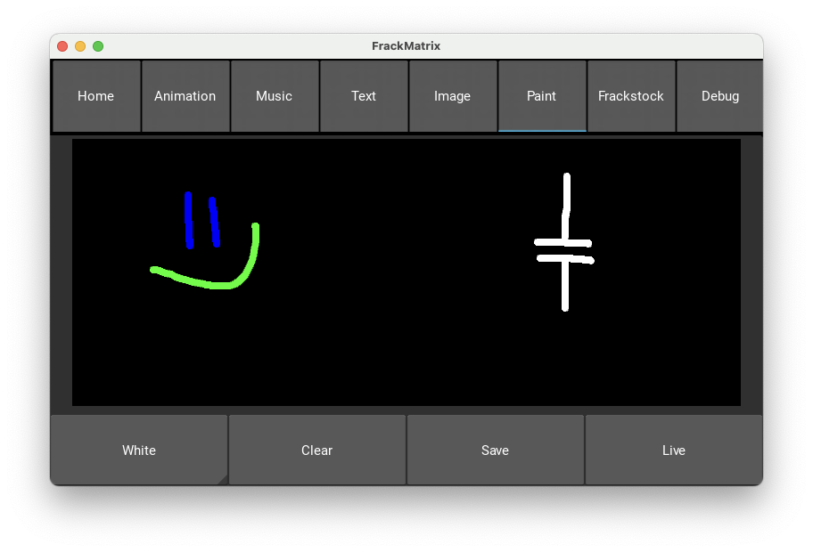

# FrackMatrix
 Led Matrix Controller with Touch UI created in Python with Kivy. The target system is a Raspberry Pi 4. It is used in combination with an Arduino Uno which is hooked up with a bunch of WS2812B (or similar) LEDs as a matrix. Commands can be sent from the Pi to the Arduino through serial over USB.

## Setup

1. Clone repository

2. Create python virtual environment
   ```shell
   python3 -m venv .venv
   ```

3. Activate venv
   ```shell
   source venv/bin/activate
   ```

4. Install libraries
   ```shell
   pip install -r requirements.txt
   ```

5. Run application

   ```shell
   ./run.sh
   ```

   

## Home

On the home screen, the serial port can be selected. Opening the spinner with the ports triggers a refresh of available ports.



## Text

- <kbd>Enter</kbd>: Send text to matrix
- <kbd>Esc</kbd>: Clear the selected text box



## Paint

Paint screen allows to draw inside a frame representing the matrix. Color can be changed with the shortcuts or more detailed with color picker. The image is sent to the matrix by pressing "Save". A "Live" mode plots the image to the matrix 10 times per second.


